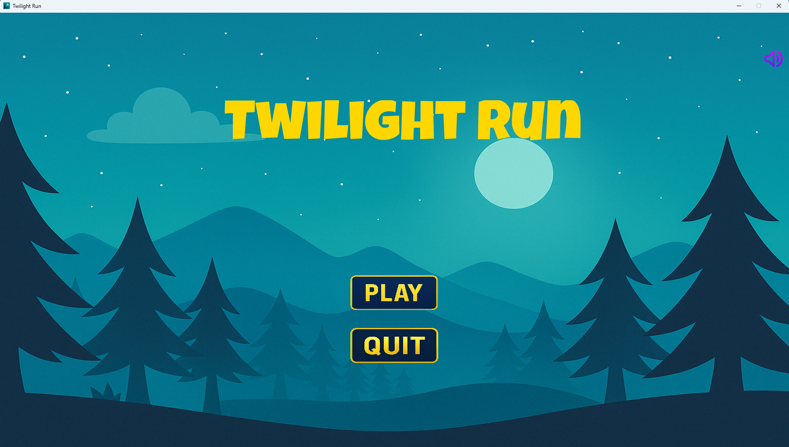
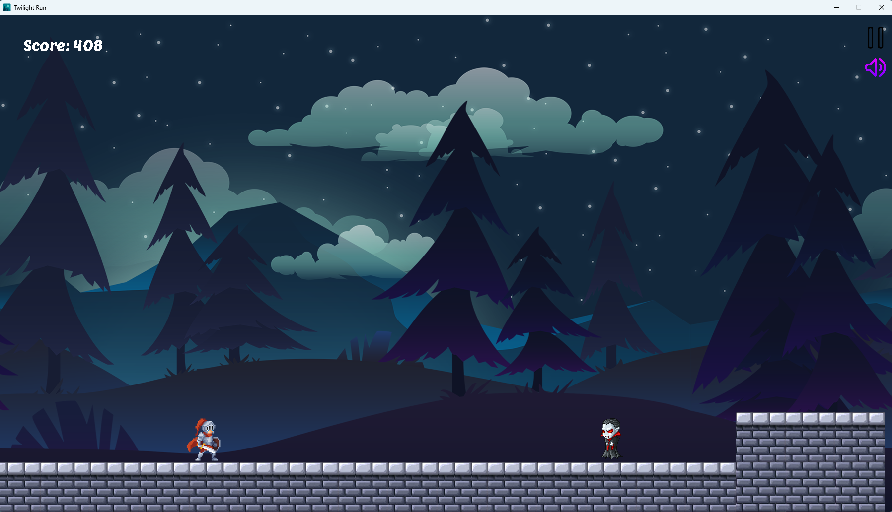
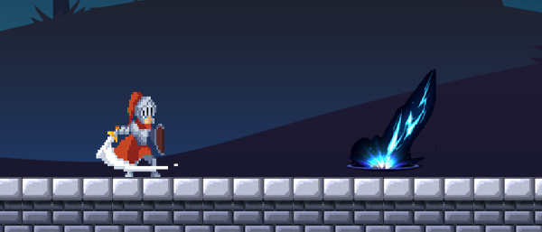
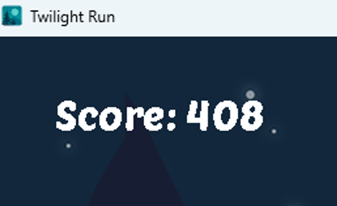
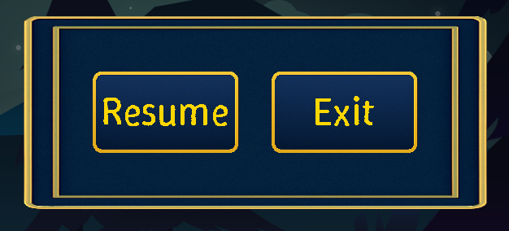
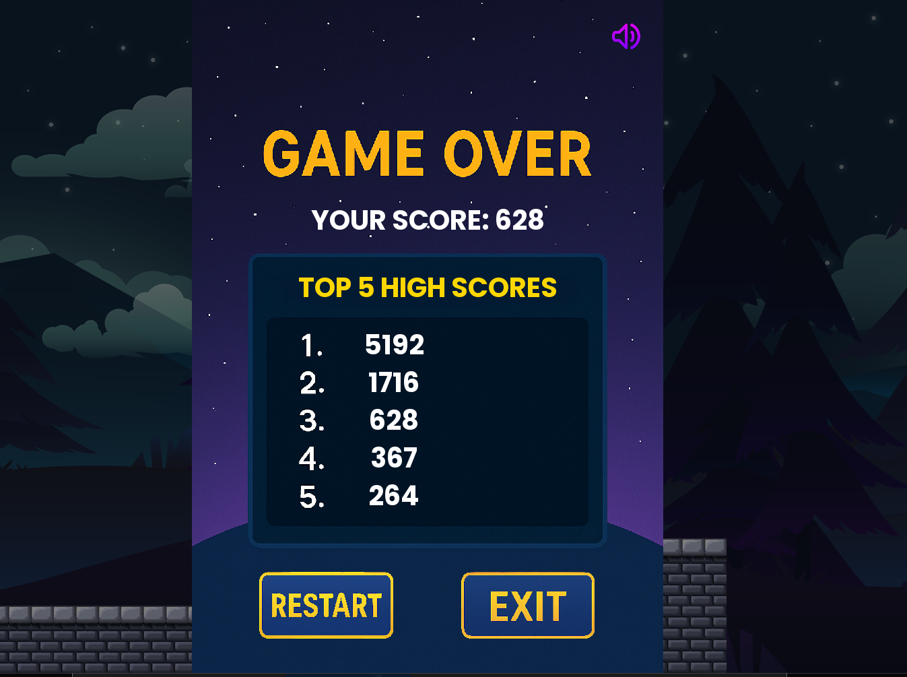

# Twilight Run - hoanganh
-[Gameplay](https://youtu.be/KwoKZ9H15hM) 
-[Source Code Introduction](https://youtu.be/mKLRMDrWedA) 
Twilight Run là một game platformer 2D đầy hành động đưa người chơi vào cuộc phiêu lưu ly kỳ trong thế giới năng động, cuộn liên tục. Là một anh hùng dũng cảm, bạn phải vượt qua những địa hình hiểm trở, chiến đấu với kẻ thù hung dữ và vượt qua chướng ngại vật để sống sót và đạt điểm cao nhất. Trò chơi kết hợp cơ chế platformer cổ điển với các tính năng hiện đại như nút giao diện người dùng tương tác, hoạt ảnh mượt mà và âm thanh sống động.
<ul>
 <li>*[0. Cách tải game](#0-cách-tải-game)*</li>
 <li>*[1. Công nghệ sử dụng](#1-công-nghệ-sử-dụng)*</li>
 <li>*[2. Tính năng chính](#2-tính-năng-chính)*</li>
 <li>*[3. Cơ chế](#3-cơ-chế)*</li>
 <li>*[4. Cách chơi](#4-cách-chơi)*</li>
</ul>

# 0. Cách tải game
Tải game đã được nén thành file Zip [tại đây](https://drive.google.com/file/d/1wmleQnT9_mk1rwYvhO0yaO-7DMMOPZ2X/view?usp=sharing) 
Sau khi cài xong, giải nén file, mở chọn *twilight_run.exe* và trải nghiệm.

# 1. Công nghệ sử dụng
Trò chơi được xây dựng bằng C++ và sử dụng các thư viện SDL2 để xử lý đồ họa, âm thanh, và đầu vào người dùng: 
<ul>
 <li>SDL2: Quản lý cửa sổ, render đồ họa, và xử lý sự kiện (phím, chuột)</li>
 <li>SDL2_image: Tải hình ảnh (PNG) cho sprite, background, và UI</li>
 <li>SDL2_ttf: Hiển thị văn bản (ví dụ: điểm số, thông báo *Pause/Game Over*)</li>
 <li>SDL2_mixer: Phát nhạc nền và hiệu ứng âm thanh (như nhảy, tấn công)</li>
 <li>Tile Map System: Sử dụng file văn bản (.txt) để định nghĩa các bản đồ tile, hỗ trợ cuộn liên tục</li>
</ul>

# 2. Tính năng chính
<ul>
 <li>Bản đồ cuộn liên tục: Người chơi di chuyển qua các bản đồ tile được tạo từ file *.txt*</li>
 <li>Nhân vật và chuyển động: Nhân vật có thể chạy, nhảy, và tấn công kẻ thù bằng đòn năng lượng</li>
 <li>Kẻ thù: Kẻ thù di chuyển và bắn đạn về phía người chơi, hồi sinh sau một khoảng thời gian</li>
 <li>Hệ thống điểm số: Điểm tăng theo thời gian sống sót, lưu điểm cao và hiển thị khi *Game Over*</li>
 <li>Tạm dừng: Nút *PAUSE* cho phép tạm dừng game</li>
 <li>Hiệu ứng *Game Over*: Phát hoạt hình chết trước khi hiển thị màn hình *Game Over*, với tùy chọn khởi động lại</li>
 <li>Âm thanh: Nhạc nền liên tục, hiệu ứng âm thanh cho các hành động như nhảy, tấn công</li>
</ul>

# 3. Cơ chế
<ul>
 <li>Di chuyển bản đồ: Bản đồ cuộn tự động từ phải sang trái với một tốc độ cuộn *(scrollSpeed)*.Tốc độ này sẽ tăng khi đạt đến một điểm số nhất định. Người chơi phải di chuyển để tránh bị đẩy ra khỏi màn hình</li>
 <li>Va chạm: Nhân vật và kẻ thù va chạm với tile map (dùng *CollisionManager*) để đứng trên nền, tránh rơi xuyên</li>
 <li>Đạn của kẻ thù và đòn tấn công của người chơi gây sát thương khi va chạm</li>
 <li>Kẻ thù tự động hồi sinh sau một khoảng thời gian</li>
 <li>Hiệu ứng tạm dừng: Khi tạm dừng, mọi chuyển động *(background, tile map, nhân vật, kẻ thù...)* dừng lại, hiển thị màn hình *"Paused"*</li>
 <li>Hoạt hình: Nhân vật có các trạng thái hoạt hình: chạy, nhảy, tấn công, và chết, được điều khiển bằng *animationTimer* và các frame tương ứng</li>
 <li>Hoạt hình chết chạy hết trước khi hiển thị màn hình *Game Over*</li>
</ul>

# 4. Cách chơi
Ngay khi khởi động, bạn sẽ bước vào giao diện Menu  
  
Tại đây, bạn có thể :
    <ul>
        <li>Nhấn *“PLAY”* để bắt đầu trò chơi</li>
        <li>Nhấn *“QUIT”* để tắt chương trình</li>
        <li>Nhấn vào biểu tượng  ở góc trên bên phải màn hình để tắt/bật âm thanh</li>
    </ul>

Sau khi nhấn nút *“PLAY”*, bạn sẽ bắt đầu trò chơi  
 
Nhấn nút *A* hoặc *D* trên bàn phím để di chuyển nhân vật sang trái hoặc phải 
Nút SPACE để nhân vật nhảy lên né các chướng ngại vật 
Để nhân vật tung ra đòn tấn công, nhấn phím *J* 
 
***Chú ý:*** 
    <ul>
        <li>Nhân vật sẽ luôn tự động trôi theo map từ phải sang trái.</li>
        <li>Khi đến gần *ENEMY*, nó sẽ nhìn thấy bạn và tiếp cận nhân vật của bạn. Đến một khoảng cách gần hơn, nó sẽ tấn công nhân vật người chơi</li>
    </ul>
Trò chơi sẽ kết thúc khi nhân vật trôi ra ngoài màn hình, rơi xuống vực, hoặc bị trúng đòn đánh của *ENEMY*. 
 
Trong quá trình chơi, điểm số của bạn sẽ tăng dần theo thời gian, bạn có thể theo dõi nó ở góc phía trên bên trái màn hình
 
Mục tiêu của trò chơi là cố gắng chạy xa nhất có thể, đạt được điểm số cao nhất. 
Bạn có thể tạm dừng bằng cách nhấn chuột trái vào nút *PAUSE* , hoặc nhấn phím *P*.  
Khi tạm dừng, bạn sẽ có các lựa chọn  
 
    <ul>
        <li>*"Resume"* để tiếp tục hành trình</li>
        <li>*"Exit"* để quay ra ngoài màn hình Menu</li>
    </ul>
Nhạc nền và hiệu ứng âm thanh cũng sẽ ngừng hoạt động khi nhấn vào nút   
Khi trò chơi kết thúc, điểm số của bạn sẽ được hiển thị cùng với 5 điểm cao nhất của các lượt chơi 
 
    <ul>
        <li>Nhấn *"RESTART"* để bắt đầu một lượt chơi mới</li>
        <li>Nhấn *"EXIT"* để quay trở về màn hình Menu</li>
    </ul>    
